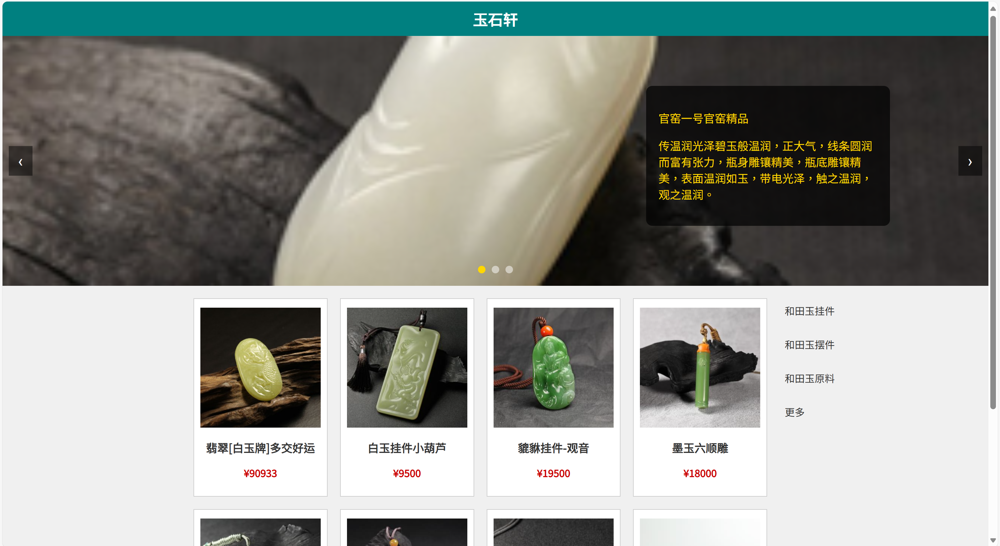

# 玉石轩 · 玉器展示网站

这是一个使用 HTML、CSS 和 JavaScript 编写的静态网页项目，旨在展示传统玉器产品，具有轮播图展示、商品信息卡片、侧边导航栏等功能模块。

## 🌟 项目亮点

- 美观布局：响应式设计，适配桌面端与移动端；
- 图片轮播：自动与手动控制的图片轮播功能；
- 商品展示：产品图片、名称与价格一目了然；
- 简洁代码：适合前端初学者阅读与学习。

## 📁 文件结构

```

├── index.html          # 网站主页
├── styles.css          # 样式文件
├── script.js           # 轮播逻辑脚本
├── images/             # 产品与轮播图图片（需自行添加）

````

## 📷 截图预览

> 建议上传一个网页效果图，并在此处展示，例如：




2. 将 `images/` 文件夹补充为你自己的图片素材；
3. 使用浏览器打开 `index.html` 即可浏览网站。

## 🧰 技术栈

* HTML5
* CSS3
* JavaScript (Vanilla JS)


👤 欢迎点赞、收藏、建议！


